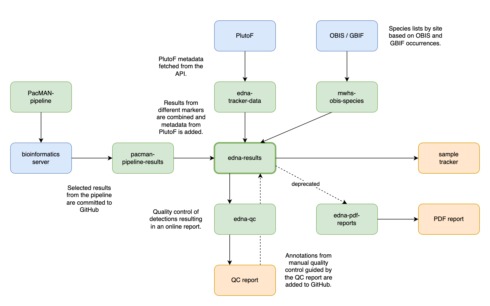

# edna-expeditions

This is the technical documentation for the eDNA Expeditions project. Data processing for eDNA Expeditions is organized in a number of public GitHub repositories that are linked together as follows:

## Data access
### Site geometries

A geopackage with all site geometries is available at <https://github.com/iobis/mwhs-shapes>.

### Site and sample information

Site and sample attributes are available at <https://github.com/iobis/edna-tracker-data/blob/data/generated.json> but also included in the biodiversity dataset below.

### Biodiversity data 🐠

Data are available at different levels of data processing:

- **Raw sequence** data will be made available later.
- A selection of files are available straight from the bioinformatics pipeline at [pacman-pipeline-results](https://github.com/iobis/pacman-pipeline-results). This includes **vsearch results, RDP classifier results, and Darwin Core tables by site and marker**.
- These individual datasets are combined together with sample metadata into an **integrated Darwin Core dataset**, and **species lists including observations from GBIF and OBIS**. This workflow is available at [edna-results](https://github.com/iobis/edna-results) and data can be downloaded from:
  - [Browse species lists](https://obis-edna-lists.s3.amazonaws.com/index.html)
  - [Download species lists](https://obis-edna-lists.s3.amazonaws.com/output_lists.zip)
  - [Download Darwin Core dataset](https://obis-edna-results.s3.amazonaws.com/output.zip)

### Environmental data 🌡️ 

To be added.

## Repositories
### Data flow

- https://github.com/iobis/PacMAN-pipeline: PacMAN bioinformatics pipeline.
- https://github.com/iobis/pacman-pipeline-results: results from the PacMAN pipeline.
- https://github.com/iobis/edna-results: processed eDNA results and species lists.
- https://github.com/iobis/edna-qc: eDNA detections quality control.
- https://github.com/iobis/mwhs-obis-species: script to extract species lists from OBIS for all marine world heritage sites.
- https://github.com/iobis/edna-gaps: regionalized gap analysis of eDNA reference databases.

### Sample tracking

- https://github.com/iobis/edna-samples: sample registration app.
- https://github.com/iobis/edna-tracker: sample tracking website.
- https://github.com/iobis/edna-tracker-data: workflow for fetching and transforming PlutoF metadata.
- https://github.com/iobis/edna-data-entry: PlutoF data entry documentation.
- https://github.com/iobis/eDNA_trial_data: includes reference database documentation.
- https://github.com/iobis/edna-issues-api: API for issue submission from sample tracker.

### Data analysis

- https://github.com/iobis/edna-science: scientific analysis ideas.
- https://github.com/iobis/edna-analysis-climate: climate analysis (thermal range of species, heat waves, etc.).

### Deprecated

- https://github.com/iobis/edna-sample-analysis
- https://github.com/iobis/edna-tracker-api
- https://github.com/iobis/edna-species-lists: workflow to create combined eDNA and OBIS species lists for sample tracker.

## Portals

- https://samples.ednaexpeditions.org/: sample tracking and species lists.
